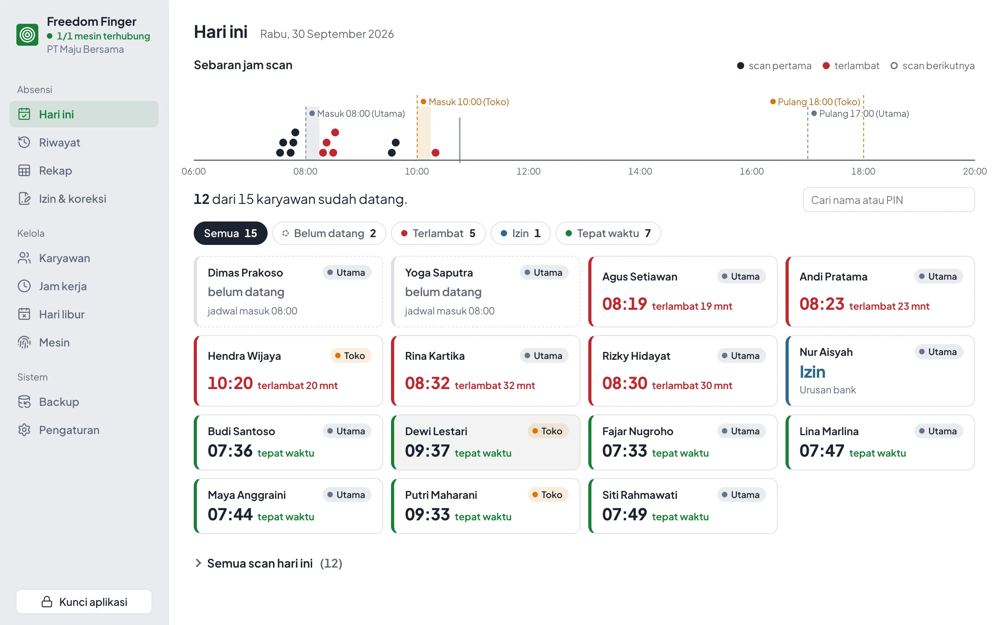
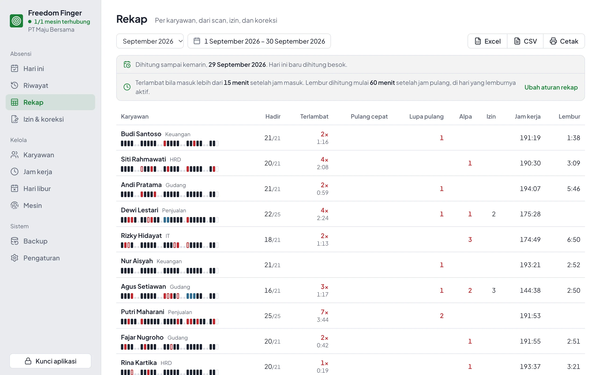
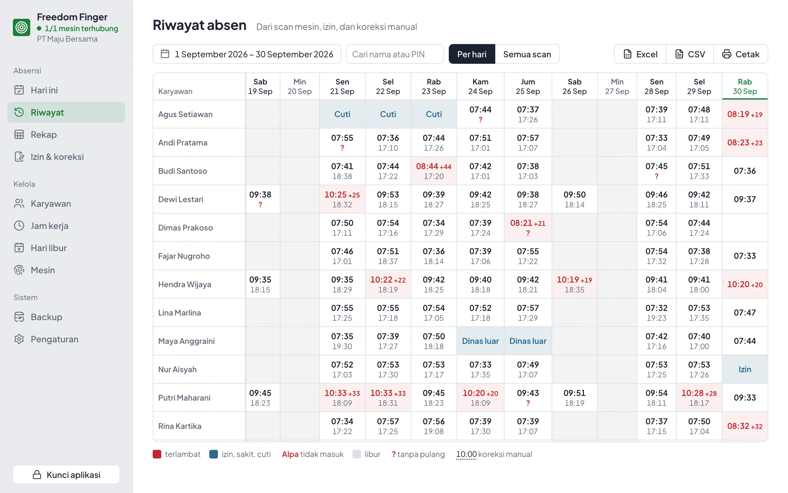
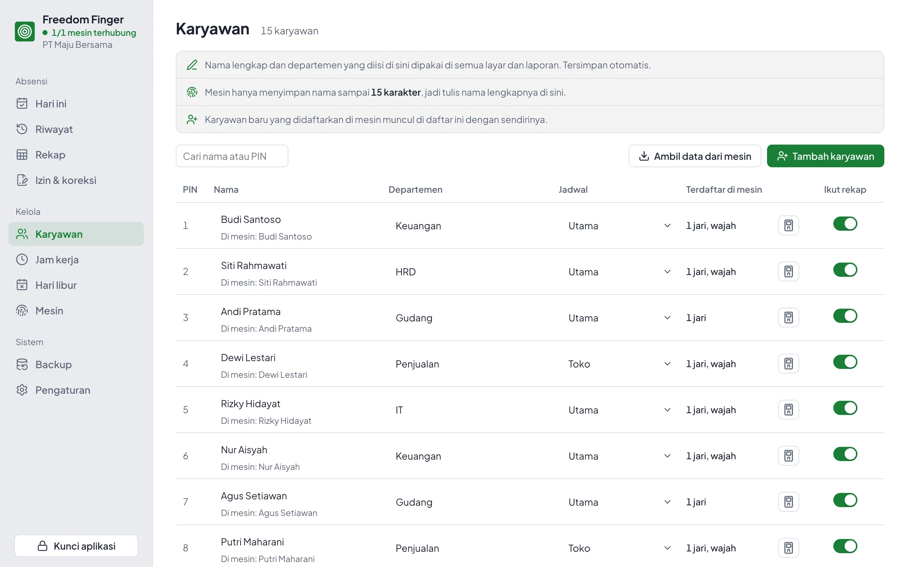
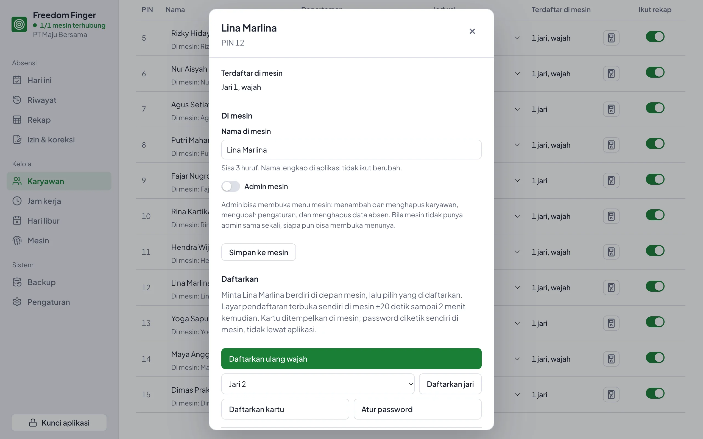
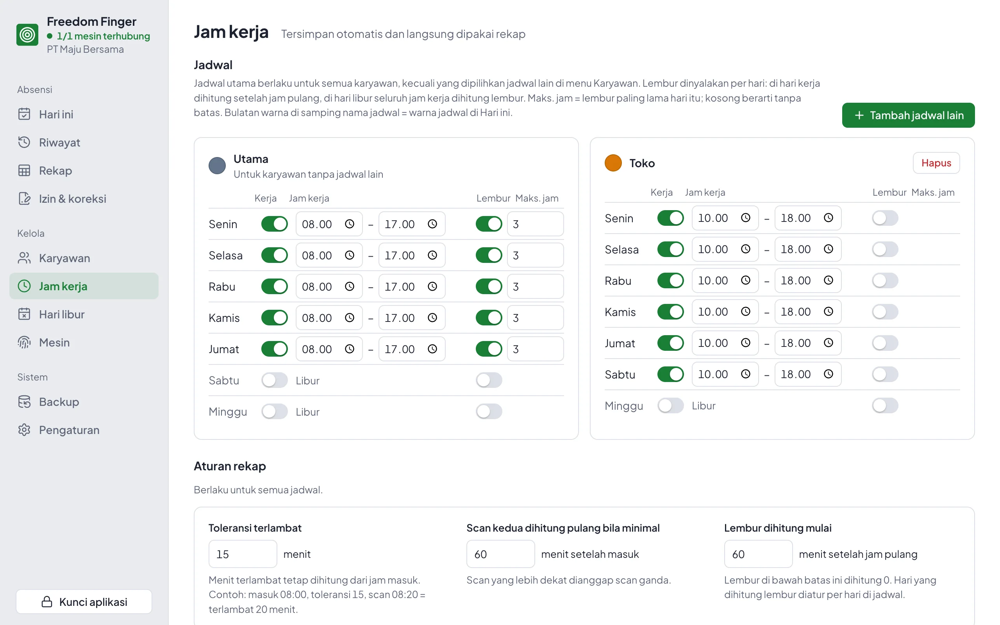
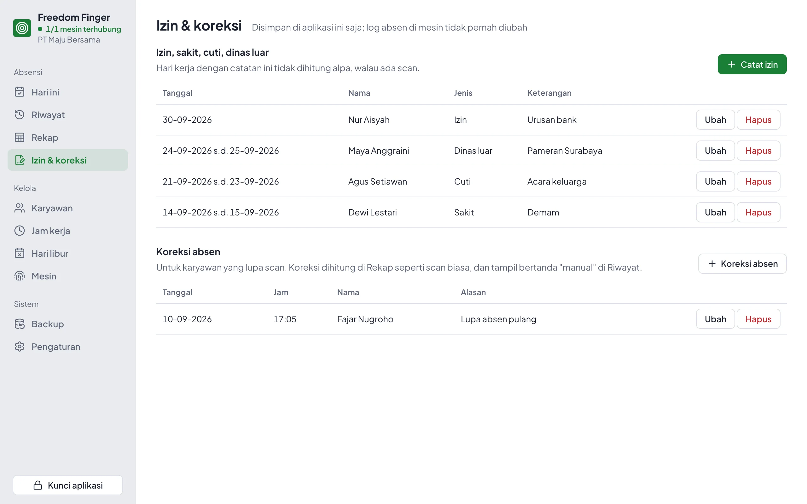
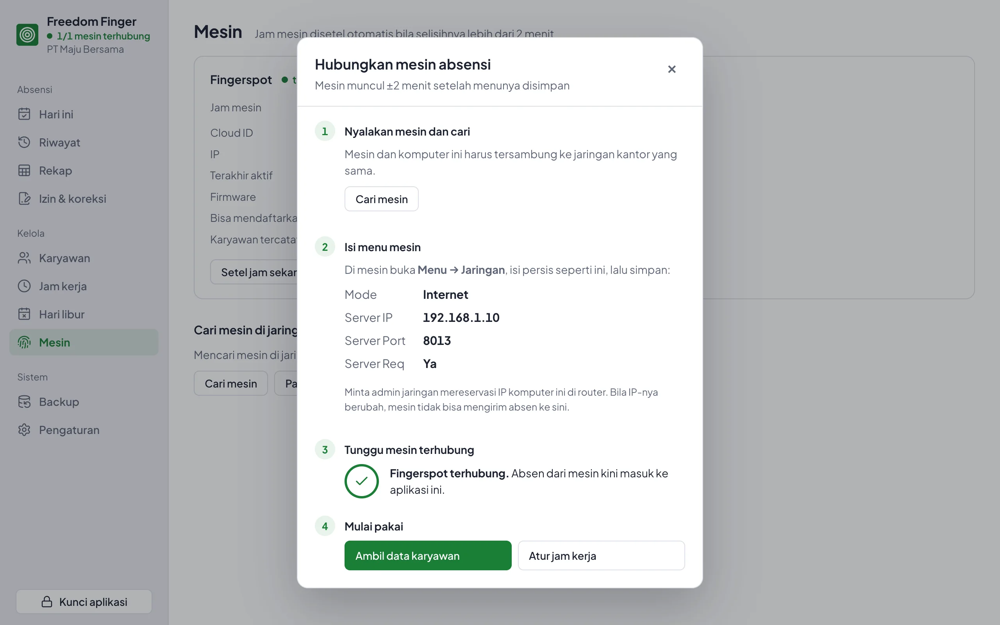
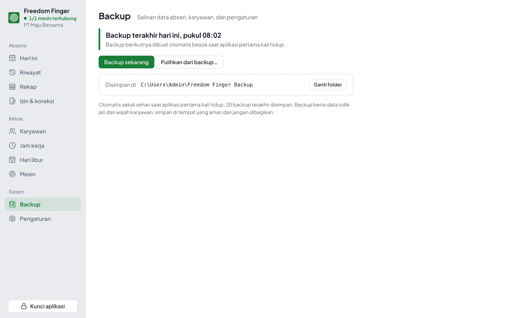

<p align="center">
  
</p>
<h1 align="center">Freedom Finger</h1>
<p align="center">
  <b>Aplikasi absensi gratis untuk mesin sidik jari dan wajah Fingerspot.</b><br>
  Tanpa cloud dan tanpa biaya langganan: absen langsung masuk ke komputer kantor Anda.
</p>
<p align="center">
  <a href="https://github.com/mazWaz/freedom-finger/releases/latest"></a>
  <a href="https://github.com/mazWaz/freedom-finger/releases"></a>
  <a href="https://github.com/mazWaz/freedom-finger/actions/workflows/ci.yml"></a>
  
  <a href="#license"></a>
</p>
<p align="center">
  <a href="https://github.com/mazWaz/freedom-finger/releases/latest"><b>Unduh aplikasi</b></a> &nbsp;·&nbsp;
  <a href="https://github.com/mazWaz/freedom-finger/wiki"><b>Panduan lengkap (Wiki)</b></a> &nbsp;·&nbsp;
  <a href="#for-developers">Untuk developer</a>
</p>

<picture>
  <source media="(prefers-color-scheme: dark)" srcset="docs/gambar/hari-ini-gelap.webp">
  
</picture>
<p align="center"><sub>Semua nama dan data di gambar adalah contoh.</sub></p>

## Why Freedom Finger

| Benefit | Details |
|---|---|
| **Tanpa cloud, tanpa langganan** | Mesin mengirim absen lewat jaringan kantor langsung ke aplikasi di PC Anda. Tidak ada biaya bulanan, dan tidak perlu internet. |
| **Data tetap milik Anda** | Absen, data karyawan, serta data jari dan wajah tersimpan di komputer kantor, bukan di server pihak lain. |
| **Rekap bulanan otomatis** | Hadir, terlambat, pulang cepat, lupa absen pulang, alpa, izin, jam kerja, dan lembur dihitung sendiri. Export ke Excel atau CSV, atau cetak. |
| **Absen tidak hilang walau PC mati** | Mesin menyimpan absen. Saat aplikasi hidup lagi, absen yang tertunda disusul otomatis. |
| **Mudah dipakai orang awam** | Tampilan berbahasa Indonesia, dengan panduan langkah demi langkah untuk menghubungkan mesin. |
| **Gratis dan open source** | Kode terbuka, boleh dipakai di kantor mana pun. Versi baru dipasang dengan satu klik dari dalam aplikasi. |

## Features

<table>
  <tr>
    <td width="50%"><br><b>Rekap bulanan.</b> Satu baris per karyawan, dengan jejak warna per hari: tepat waktu, terlambat, alpa, izin, libur.</td>
    <td width="50%"><br><b>Riwayat absen.</b> Jam masuk dan pulang setiap orang per tanggal, lengkap dengan izin dan koreksi manual.</td>
  </tr>
  <tr>
    <td><br><b>Kelola karyawan.</b> Ambil data dari mesin, isi nama lengkap, departemen, dan jadwal kerja.</td>
    <td><br><b>Daftarkan dari aplikasi.</b> Tambah karyawan, daftarkan wajah, jari, kartu, atau password, ganti nama, dan atur admin mesin.</td>
  </tr>
  <tr>
    <td><br><b>Jam kerja fleksibel.</b> Beberapa jadwal (kantor, toko, shift), toleransi terlambat, dan lembur per hari.</td>
    <td><br><b>Izin dan koreksi.</b> Catat izin, sakit, cuti, dan dinas luar, serta koreksi untuk yang lupa scan.</td>
  </tr>
  <tr>
    <td><br><b>Panduan menghubungkan mesin.</b> Isian menu mesin ditampilkan persis, lalu aplikasi memberi tanda begitu mesin terhubung.</td>
    <td><br><b>Backup otomatis.</b> Sekali sehari, 30 backup terakhir disimpan, dan bisa dipulihkan kapan saja.</td>
  </tr>
</table>

## Download

| Komputer | File di [halaman rilis](https://github.com/mazWaz/freedom-finger/releases/latest) |
|---|---|
| Windows 10/11 (64-bit) | `freedom-finger-desktop-windows-x64-setup.exe` |
| Mac (Apple Silicon dan Intel) | `freedom-finger-desktop-macos.dmg` |
| Linux (64-bit) | `freedom-finger-desktop-linux-x64.deb` atau `.AppImage` |

Installer belum bertanda tangan digital. Di Windows, bila muncul "Windows protected your PC", klik
**More info → Run anyway**. Di Mac, bila aplikasi ditolak, jalankan
`xattr -cr "/Applications/Freedom Finger.app"` di Terminal. Langkah lengkapnya ada di
[Memasang Aplikasi](https://github.com/mazWaz/freedom-finger/wiki/Memasang-Aplikasi).

## Quick start

1. **Pasang dan buka aplikasi**, lalu buat kata sandi. Aplikasi jalan sendiri setiap PC dinyalakan
   dan tetap aktif di tray walau jendelanya ditutup.
2. **Hubungkan mesin.** Panduan muncul sendiri: di mesin, buka **Menu → Jaringan** dan isi Mode
   Internet, Server IP, Server Port `8013`, dan Server Req Ya, persis seperti di layar. Mesin
   terhubung dalam ±2 menit. Lihat [Menghubungkan Mesin](https://github.com/mazWaz/freedom-finger/wiki/Menghubungkan-Mesin).
3. **Ambil data karyawan dan atur jam kerja.** Setelah itu, halaman **Rekap** langsung menghitung
   kehadiran bulan ini.

PC tidak perlu menyala 24 jam. Minta admin jaringan **mereservasi IP PC ini di router**, karena
mesin selalu mengirim ke IP yang sama. Aplikasi memberi peringatan bila IP-nya berubah.

## Supported devices

| Mesin | Status |
|---|---|
| Fingerspot Revo WF-206BNC | Diuji di kantor: absen realtime, ambil data karyawan, jam mesin. Tambah karyawan dan daftar wajah/jari dari aplikasi baru diuji dengan mesin tiruan |
| Mesin Fingerspot lain dengan menu Jaringan → Mode Internet | Kemungkinan bisa, belum diuji. Ceritakan hasilnya di [Issues](https://github.com/mazWaz/freedom-finger/issues) |

> Freedom Finger adalah proyek independen dan tidak berafiliasi dengan Fingerspot.
> "Fingerspot" disebut hanya untuk menjelaskan mesin yang didukung.

## Help

- [Wiki](https://github.com/mazWaz/freedom-finger/wiki): panduan lengkap untuk pemakai, dari memasang sampai membaca rekap.
- [Pertanyaan Umum](https://github.com/mazWaz/freedom-finger/wiki/Pertanyaan-Umum) dan [Mengatasi Masalah](https://github.com/mazWaz/freedom-finger/wiki/Mengatasi-Masalah).
- Menemukan bug atau punya usul? Buka [Issue](https://github.com/mazWaz/freedom-finger/issues/new).
- Suka proyek ini? Beri **Star** agar lebih banyak kantor menemukannya.

### In English

Freedom Finger is a free, open-source, local attendance system for Fingerspot fingerprint and face
terminals (tested on the Revo WF-206BNC). The device pushes every scan to a desktop app on your
office PC over the LAN: no cloud, no subscription. The desktop app (Windows, macOS, Linux) shows
today's attendance, history, a monthly recap with Excel export, leave and corrections, backups, and
updates itself. Developers get a Rust server and SDK with an HTTP API in the style of
developer.fingerspot.io. The app and docs are in Indonesian.

---

## For developers

### Server program

Untuk server 24 jam atau integrasi sendiri, pasang program `freedom-finger` sebagai layanan:

1. Unduh satu file dari [Releases](https://github.com/mazWaz/freedom-finger/releases/latest):
   Windows `freedom-finger.exe`; Linux `freedom-finger-linux-x64` (ARM64: `freedom-finger-linux-arm64`);
   Mac `freedom-finger-macos-arm64` (Intel: `freedom-finger-macos-x64`).
2. Pasang sebagai layanan, dengan hak admin:
   ```sh
   .\freedom-finger.exe install                  # Windows, terminal "Run as administrator"
   chmod +x freedom-finger-linux-x64            # Linux, macOS: sesuaikan nama file
   sudo ./freedom-finger-linux-x64 install
   ```
3. Isi menu mesin persis seperti yang tampil di layar, lalu buka `http://localhost:8013`
   untuk melihat mesin terhubung dan jumlah absen hari ini.

```text
✓ Terpasang di C:\FreedomFinger, jalan otomatis saat komputer menyala
✓ Firewall: port 8013 dibuka untuk jaringan lokal

Atur di mesin absensi (Menu → Jaringan):
  Mode         Internet
  Server IP    192.168.1.10
  Server Port  8013
  Server Req   Ya
```

Tidak ada file yang perlu diedit: token API dibuat otomatis di `freedom-finger.env`. Tidak tahu
IP mesin? `freedom-finger cari` mencarinya di jaringan lokal. macOS/Linux: program unduhan perlu
`chmod +x`, dan di macOS juga `xattr -d com.apple.quarantine <file>`.

### API

Aplikasi Anda (bahasa apa pun) memanggil `http://<server>:8013/api/<endpoint>` dengan header
`Authorization: Bearer <token>`; tokennya ada di `freedom-finger.env`. Absen baru dan hasil
perintah bisa diterima realtime lewat `GET /api/events`.

```sh
curl -s http://localhost:8013/api/get_attlog -H "Authorization: Bearer $TOKEN" \
  -d '{"start_date":"2026-09-29","end_date":"2026-09-29"}'
```

| Dokumen | Isi |
|---|---|
| [`docs/api.md`](docs/api.md) | Semua endpoint, contoh request dan balasan, event realtime, contoh JavaScript tanpa pustaka |
| [`docs/openapi.yaml`](docs/openapi.yaml) | Spesifikasi OpenAPI 3.1, untuk Swagger UI atau generator klien |
| [`examples/tauri-dashboard`](examples/tauri-dashboard) | Kode aplikasi desktop: contoh menanam server di aplikasi Rust dan memakai API-nya |

## Commands

| Perintah | Isi |
|---|---|
| `freedom-finger` | Jalankan server di terminal (folder data = folder program, atau `--data <folder>`) |
| `freedom-finger install` / `uninstall` | Pasang atau lepas layanan; data tidak pernah dihapus |
| `freedom-finger status` | Server berjalan? Mesin terhubung? Jumlah absen |
| `freedom-finger cari` | Cari mesin di jaringan lokal, beserta petunjuk untuk tiap mesin |
| `freedom-finger backup FILE` | Salin database ke `FILE`, aman saat server berjalan. Isinya termasuk data jari/wajah: simpan di tempat aman |

| Folder | Isi |
|---|---|
| `crates/freedom-finger` | Program dan library server: menerima data mesin, API bergaya developer.fingerspot.io, SQLite |
| `crates/freedom-finger-sdk` | SDK: protokol FkWeb (mode Internet), tanpa I/O |
| `examples/tauri-dashboard` | Aplikasi desktop untuk pengguna, sekaligus contoh dan demo: server tertanam, riwayat, rekap, export, backup |

## Build and test

Hanya perlu bila tidak memakai file rilis. Butuh [rustup](https://rustup.rs); versi Rust dipasang
otomatis dari `rust-toolchain.toml`. Rilis dibuat oleh `.github/workflows/release.yml` saat tag
`v*` di-push.

```sh
cargo build --release     # target/release/freedom-finger
cargo test --workspace    # uji offline, tanpa mesin
```

## Settings

Semua opsional. Server membaca `freedom-finger.env` di folder data; variabel environment
menang bila keduanya ada.

| Variabel | Bawaan | Isi |
|---|---|---|
| `FKWEB_TOKEN` | dibuat otomatis | Token Bearer untuk `/api/*`, minimal 16 karakter |
| `FKWEB_PORT` | `8013` | Port untuk mesin dan API |
| `FKWEB_DB` | `absensi.db` | Database SQLite, relatif ke folder data |
| `FKWEB_TZ` | `Asia/Jakarta` | Zona jam mesin |
| `FKWEB_DEVICES` | semua | Cloud ID mesin yang diterima, pisah koma |
| `FKWEB_WEBHOOK` | - | URL penerima callback |
| `FKWEB_PHOTOS` | `photos` | Folder foto absen, relatif ke folder data |

Dokumentasi API: `docs/api.md`.

## Documents

| File | Isi |
|---|---|
| `docs/arsitektur.md` | Susunan kode, keputusan, cara menambah perintah dan endpoint |
| `docs/operasional.md` | Menjalankan server, API, pekerjaan sehari-hari, masalah umum |
| `docs/api.md` | API untuk aplikasi: endpoint, contoh, event realtime |
| `docs/openapi.yaml` | Spesifikasi API (OpenAPI 3.1) |
| `docs/protokol.md` | Spesifikasi FkWeb (mode Internet), rekaman biner, dan handshake untuk pencarian mesin |
| `docs/riset.md` | Laporan riset dan riwayat keputusan |

## License

Dual license [MIT](LICENSE-MIT) atau [Apache-2.0](LICENSE-APACHE), pilih salah satu.
